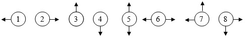

**Bài 3/1999 -**** Mạng tế bào**

(_Dành cho học sinh THPT_)

Mạng tế bào có dạng một lưới ô vuông hình chữ nhật. Tại mỗi nhịp thời gian: mỗi ô của lưới chứa tín hiệu là 0 hoặc 1 và có thể truyền tín hiệu trong nó cho một số ô kề cạnh theo một qui luật cho trước. Ô ở góc trên bên trái có thể nhận tín hiệu từ bên ngoài đưa vào. Sau nhịp thời gian đó, tín hiệu ở một ô sẽ là 0 nếu tất cả các tín hiệu truyền đến nó là 0, còn trong trường hợp ngược lại tín hiệu trong nó sẽ là 1. Một ô không nhận được tín hiệu nào từ các ô kề cạnh với nó sẽ giữ nguyên tín hiệu đang có trong nó. Riêng đối với ô trên trái, sau khi truyền tín hiệu chứa trong nó đi, nếu có tín hiệu vào thì ô trên trái sẽ ***chỉ*** nhận tín hiệu này, còn nếu không có tín hiệu nào thì ô trên trái cũng hoạt động giống như các ô khác. ở trạng thái đầu tín hiệu trong tất cả các ô là 0.

**Yêu cầu:** Cho trước số nhịp thời gian T và dãy tín hiệu vào S là một dãy gồm T ký hiệu $S_1, ..., S_T$, trong đó $S_i$ là 0 hoặc 1 thể hiện có tín hiệu vào, ngược lại $S_i$ là X thể hiện không có tín hiệu vào tại nhịp thời gian thứ i (1 ≤ i ≤ T), hãy xác định trạng thái của lưới sau nhịp thời gian thứ T.

**Dữ liệu:** vào từ file văn bản P3.INP:

- Dòng đầu tiên chứa 3 số nguyên M, N, T theo thứ tự là số dòng, số cột của lưới và số nhịp thời gian (1 ≤ M, N ≤ 200; T ≤ 100);
- Dòng thứ hai chứa xâu tín hiệu vào S;
- M dòng tiếp theo mô tả qui luật truyền tin. Dòng thứ i trong số M dòng này chứa N số $a_{i1}, a_{i2}, ..., a_{iN}$, trong đó giá trị của $a_{ij}$ sẽ là 1, 2, 3, 4, 5, 6, 7, 8 tương ứng lần lượt nếu ô (i, j) phải truyền tin cho ô kề cạnh bên trái, bên phải, bên trên, bên dưới, bên trên và bên dưới, bên trái và bên phải, bên trên và bên trái, bên dưới và bên phải (xem hình vẽ); còn nếu ô (i, j) không phải truyền tín hiệu thì $a_{ij}$ = 0.

**Kết quả:** Ghi ra file văn bản P3.OUT gồm M dòng, mỗi dòng là một xâu gồm N ký tự 0 hoặc 1 mô tả trạng thái của lưới sau nhịp thời gian thứ T.

**Ví dụ:**

| P3.INP | P3.OUT |
| --- |  --- |
| 2 2 5  101XX  2 4 2 1 |11 01    |

Quá trình biến đổi trạng thái được diễn tả trong hình dưới đây:

| 0 | 0 ||1|0||0|1||1|0||1|1||1|1|
|---|---|---|---|---|---|---|---|---|---|---|---|---|---|---|---|---|
| 0 | 0 ||0|0||0|0||0|1||1|0||0|1|
